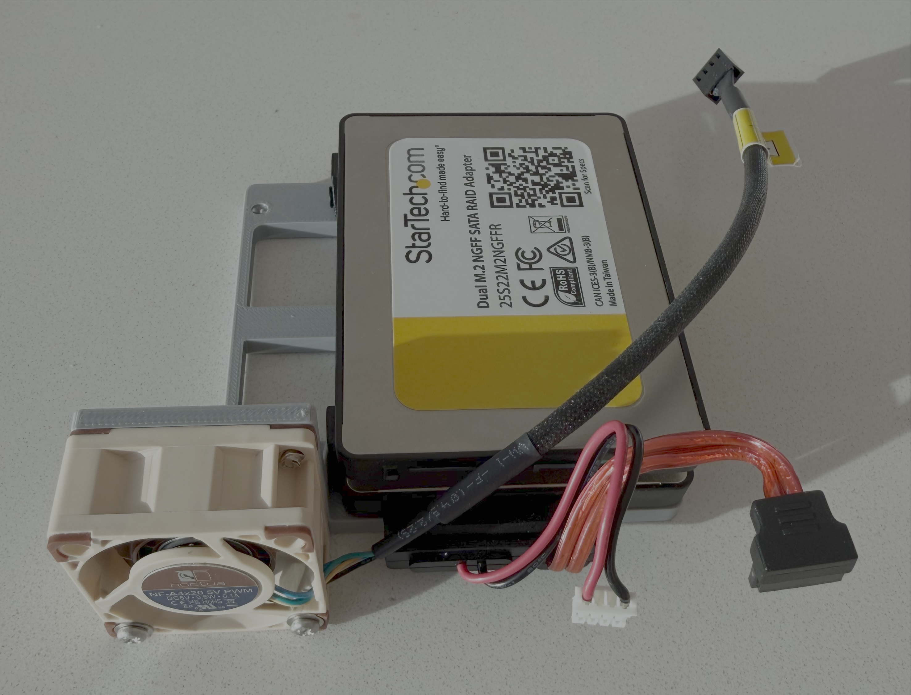
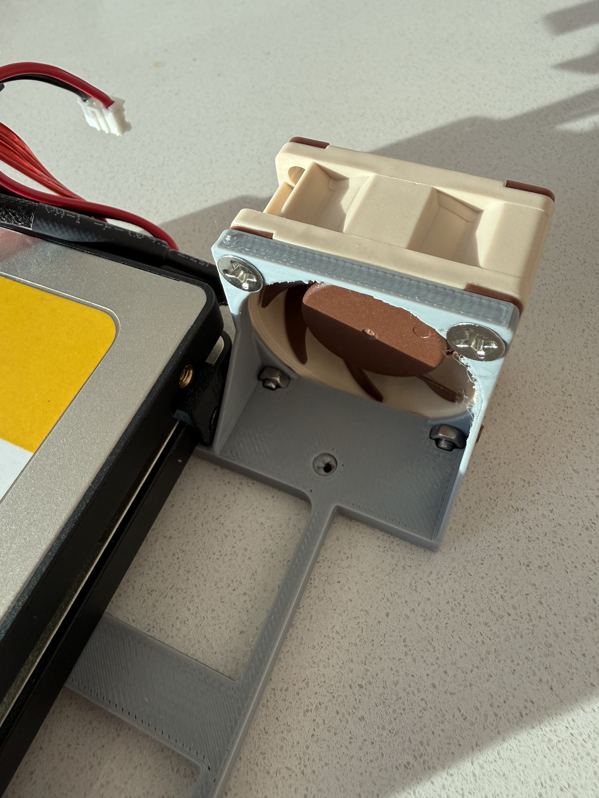
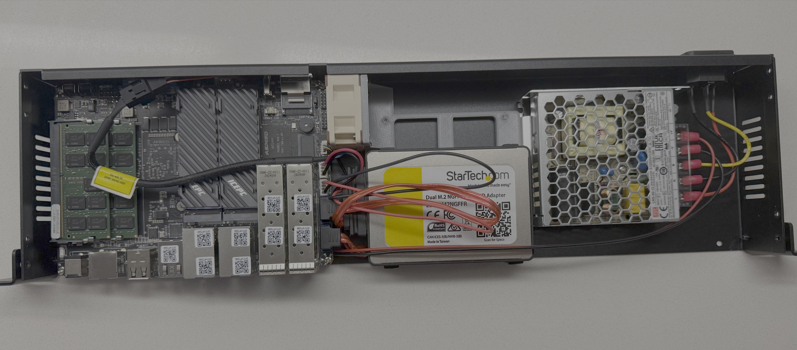
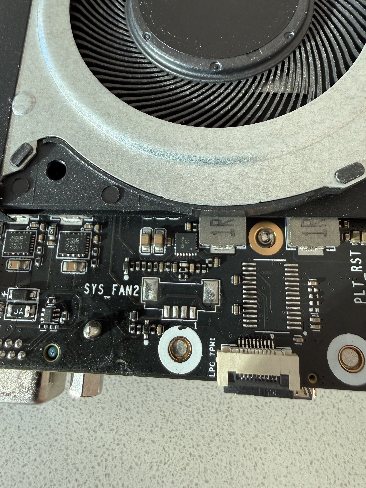

# Bracket for Qotom Q20300S9 1U11 series

This bracket attaches to the 2.5" drive spot, shifts the drive(s) over and adds a mount for a 40mm fan. It was designed in FreeCAD and is largely parametric.

I stacked two 2.5" drives using [Ryan Gingerich's SSD Stackers](https://www.ryang3d.com/shop/ssd-stackers/). The added fan was connected to the SYS_FAN2 connection on the bottom of the mainboard using a [Molex 0532610471 CONN HEADER SMD R/A 4POS 1.25MM](https://www.digikey.com/en/products/detail/molex/0532610471/699096).

## Bracket with stacked drives and fan

## Bracket reverse showing captive hex nuts for fan mounting

## Installed inside case

## SYS_FAN2 4-pin connector

